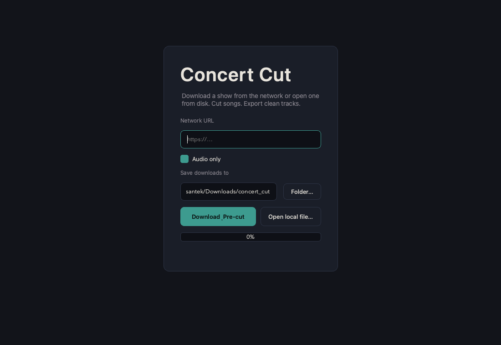
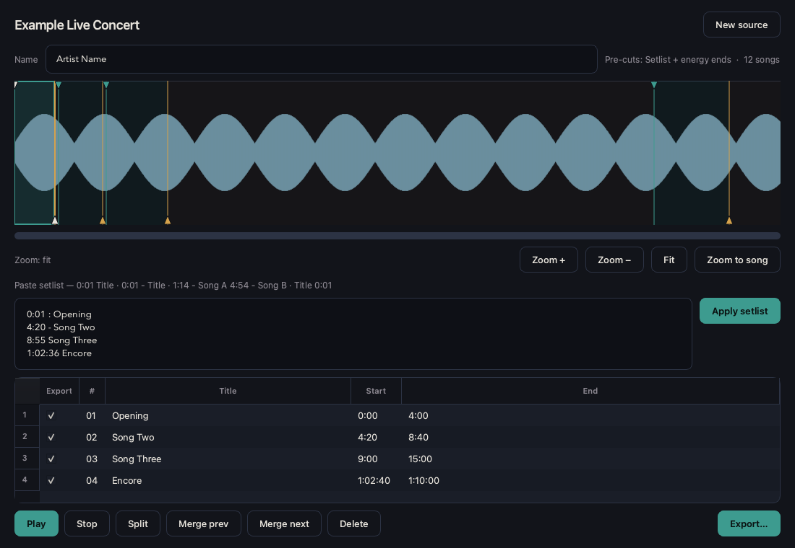

# Concert Cut

Download a concert from the network or open a local file, cut it into songs, and export tagged tracks.

`concert_cut` is the project / folder name. The app displays as **Concert Cut**.





## Features

- Download from a network URL, or open audio/video from disk
- Pre-cut from chapters, energy gaps, or a pasted **setlist**
- Setlist starts kept; song **ends** refined to quiet gaps when possible
- Waveform editor with begin/end handles, zoom, and scroll
- Export selected songs with Name + Title tags
- Sidecar save (`*.concertcut.json`) so local reopen keeps your cuts

## Requirements

- Python 3.10+
- [ffmpeg](https://ffmpeg.org/) on your PATH (`brew install ffmpeg`)

## Setup

```bash
cd y_audio_download_cut
python3 -m venv .venv
source .venv/bin/activate
pip install -r requirements.txt
```

## Run

```bash
source .venv/bin/activate
python -m app.main
```

Downloads default to `~/Downloads/concert_cut/`.

## Flow

1. Paste a **network URL** and click **Download & Pre-cut**, or **Open local file…**
2. Review pre-cuts (chapters or energy detection)
3. Optionally paste a setlist and click **Apply setlist**
4. Tweak titles and begin/end handles; preview with Play
5. **Export…** checked songs (mp3 / m4a / wav)

Edits are saved beside the media file as `*.concertcut.json`.

## Setlist formats

```text
0:01 : Wrong ones
6:19 - Circles
10:45 What don't belong to me
[22:10] M-E-X-I-C-O
1. 29:17 I Like you
1:02:36 Pour me a drink
Sunflower 1:24:30

# Or one line with many songs:
1:14 - All The Little Lights 4:54 - Life's For The Living 9:30 - Riding To New York
```

## Tips

- Scroll wheel zooms the waveform; scrollbar (or Shift+wheel) pans when zoomed
- Green △ = song start (top); amber ▽ = song end (bottom)
- Use only for content you are allowed to download and process
