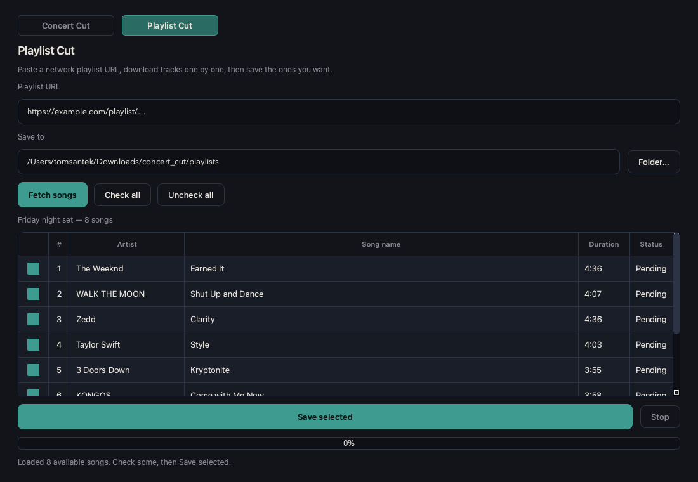

# Track Cut

**Track Cut** is a desktop app for pulling audio from the network or disk, then turning it into clean individual tracks — either by cutting a long concert recording, or by saving songs from a playlist.

Two modes: **Concert** (download / open a show, cut songs on a waveform, export) and **Playlist** (fetch a network playlist or single track, pick songs, save).

`track_cut` is the project / folder name.




## Features

### Concert

- Download from a network URL, or open audio/video from disk
- Pre-cut from chapters, energy gaps, or a pasted **setlist**
- Setlist starts kept; song **ends** refined to quiet gaps when possible
- Waveform editor with begin/end handles, zoom, and scroll
- Export selected songs with Name + Title tags
- Sidecar save (`*.trackcut.json`) so local reopen keeps your cuts

### Playlist

- Paste a **network playlist URL** (or a single track URL)
- **Fetch songs** lists available tracks (Artist + Song name + duration)
- Unavailable / incomplete tracks are hidden
- **Save selected** downloads checked songs into your **Save to** folder
- Progress popup while fetching or downloading; **Stop** cancels after the current song
- Files named `NN - Artist - Song.m4a` under a playlist subfolder
- A single-track network URL loads **one** song (related/mix links are ignored)

## Requirements

- Python 3.10+
- [ffmpeg](https://ffmpeg.org/) on your PATH (`brew install ffmpeg`)

## Setup

```bash
git clone <repo-url> track_cut
cd track_cut
python3 -m venv .venv
source .venv/bin/activate
pip install -r requirements.txt
```

## Run

```bash
source .venv/bin/activate
python -m app.main
```

Concert downloads default to `~/Downloads/track_cut/`.  
Playlist saves default to `~/Downloads/track_cut/playlists/`.

## Flow

### Concert

1. Open the **Concert** tab
2. Paste a **network URL** → **Download & Pre-cut**, or **Open local file…**
3. Review pre-cuts (chapters or energy detection)
4. Optionally paste a setlist → **Apply setlist**
5. Tweak titles and begin/end handles; preview with Play
6. **Export…** checked songs (mp3 / m4a / wav)

Edits are saved beside the media file as `*.trackcut.json`.

### Playlist

1. Open the **Playlist** tab
2. Paste a **network playlist URL** (or one track URL) → **Fetch songs**
3. Check the songs you want
4. Confirm **Save to** folder → **Save selected**
5. Wait for the download popup to finish

## Setlist formats (Concert)

```text
0:01 : Wrong ones
6:19 - Circles
10:45 What don't belong to me
[22:10] M-E-X-I-C-O
1. 29:17 I Like you
1:02:36 Pour me a drink
Sunflower 1:24:30

# Or one line with many songs:
1:14 - All The Little Lights 4:54 - Life's For The Living 9:30 - Riding To New York
```

## Tips

- Concert: scroll wheel zooms the waveform; scrollbar (or Shift+wheel) pans when zoomed
- Concert: teal △ = song start (top); amber ▽ = song end (bottom)
- Playlist: click a row to toggle its checkbox; use **Check all** / **Uncheck all**
- Keep UI and docs free of site-specific branding — treat sources as generic network media

## Contributing

Issues and pull requests are welcome. Do not add site-specific branding in the UI or README.

## License

This project is licensed under the [MIT License](LICENSE).

## Responsible use

Use Track Cut only with media you have the right to download and process. Respect the terms of any site or service you access, and applicable copyright law. The authors are not responsible for misuse.
